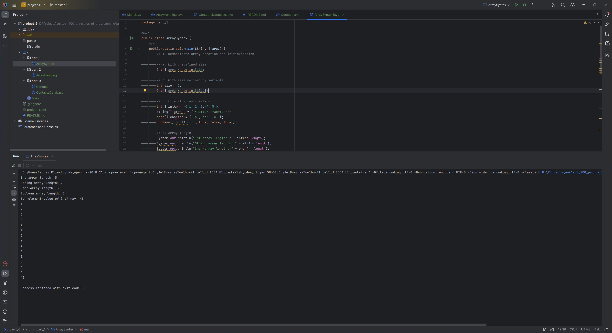
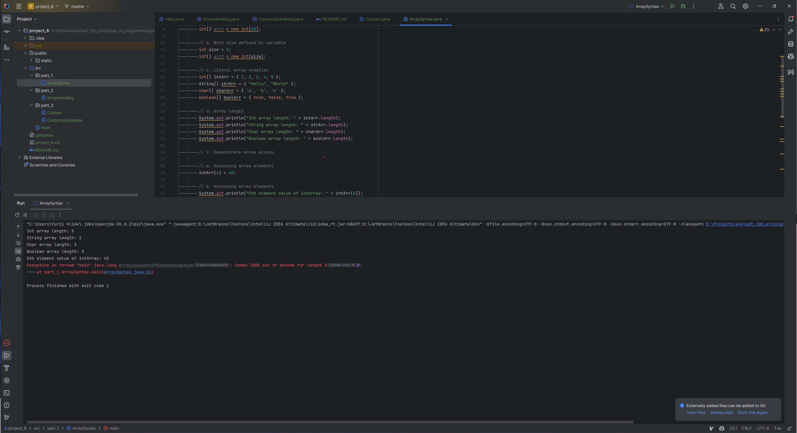
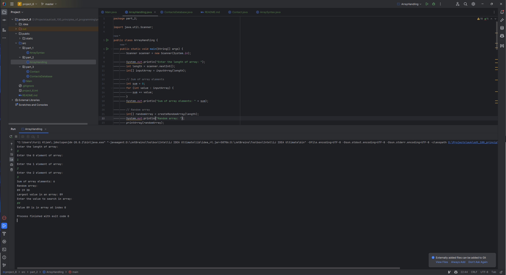
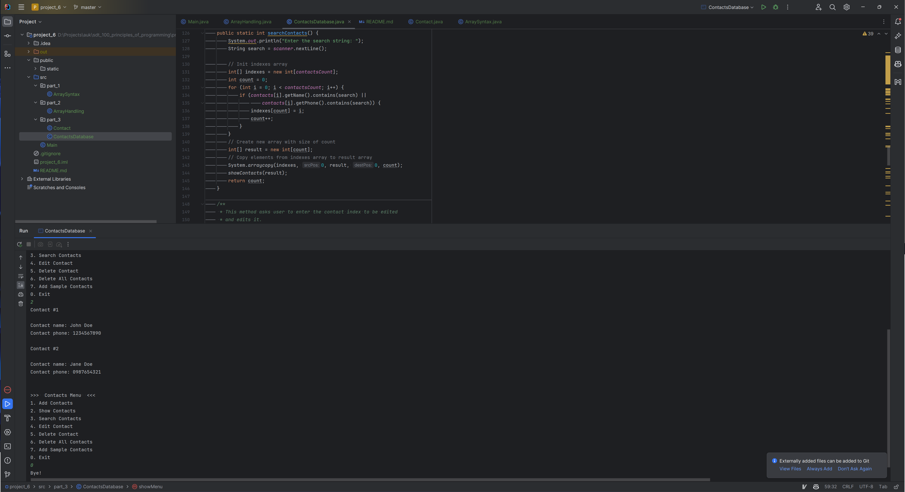

# UK SDT 100: Principles of Programming FA23: Project 6. Arrays

A series of Java projects demonstrating various programming techniques and best practices.

## Table of Contents

- [File Structure](#file-structure)
- [Part 1: Array Syntax](#part-1-array-syntax)
- [Part 2: Array Handling](#part-2-array-handling)
- [Part 3: Contacts Database](#part-3-contacts-database)

## File Structure

<pre>
project_5
│
├── public
│   └── static
│       └── [screenshots]
│
├── src
│   ├── part_1
│   │   └── ArraySyntax.java
│   │
│   ├── part_2
│   │   └── ArrayHandling.java
│   │
│   └── part_3
│       ├── Contact.java
│       └── ContactsDatabase.java
│
├── .gitignore
├── README.md
└── project_6.iml
</pre>

## Part 1: Array Syntax

This part focuses on the demonstration of array syntax

## Part 2: Array Handling

This part focuses on the demonstration of array handling

## Part 3: Contacts Database

This part focuses on creating a program with user friendly console interface for adding, editing and searching personal contacts.

